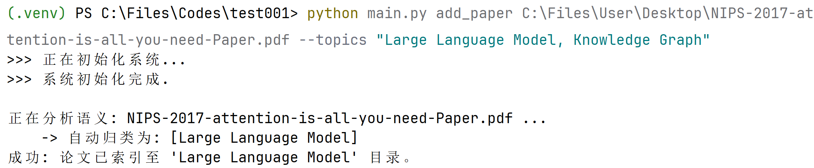
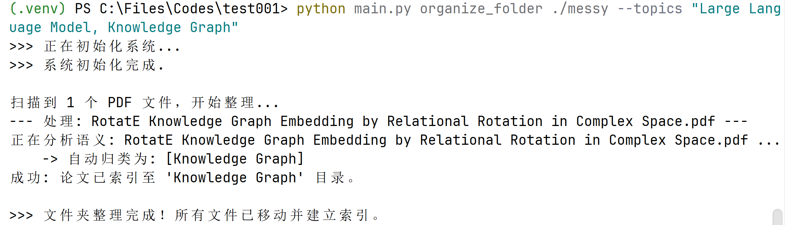
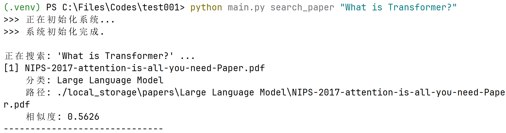
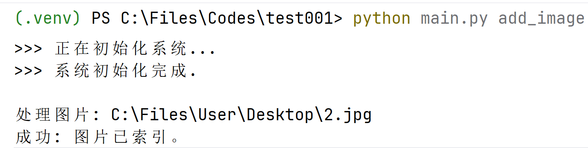
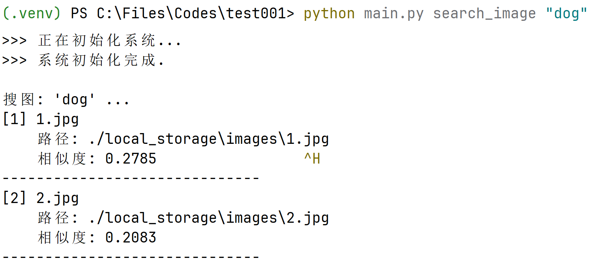

# 本地 AI 智能文献与图像管理助手

## 1. 项目简介 (Project Introduction)

本项目是一个基于 Python 的本地多模态 AI 智能助手，旨在解决本地大量文献和图像素材管理困难的问题。不同于传统的文件名搜索，本项目利用多模态神经网络技术，实现对内容的**语义搜索**和**自动分类**。

## 2. 核心功能 (Core Features)

### 2.1 智能文献管理

*   **语义搜索**: 支持使用自然语言提问（如“Transformer 的核心架构是什么？”）。系统需基于语义理解返回最相关的论文文件，进阶要求可返回具体的论文片段或页码。
*   **自动分类与整理**:
    *   **单文件处理**: 添加新论文时，根据指定的主题（如 "CV, NLP, RL"）自动分析内容，将其归类并移动到对应的子文件夹中。
    *   **批量整理**: 支持对现有的混乱文件夹进行“一键整理”，自动扫描所有 PDF，识别主题并归档到相应目录。
*   **文件索引**: 支持仅返回相关文件列表，方便快速定位所需文献。

### 2.2 智能图像管理

*   **以文搜图**: 利用多模态图文匹配技术，支持通过自然语言描述（如“海边的日落”）来查找本地图片库中最匹配的图像。

## 3. 技术选型 (Technical Stack)

本项目采用模块化设计，支持替换不同的后端模型。

*   **文本嵌入**: `text-embedding-v3` (阿里云) —— 调用API连接，无需本地资源。
*   **图像嵌入**: `clip-ViT-B-32` —— OpenAI 开源的经典图文匹配模型。
*   **向量数据库**: `ChromaDB` —— 无需服务器，开箱即用的嵌入式数据库。

## 4. 使用说明 (Instructions)

### 4.1 安装

```
git clone https://github.com/HongxiangLu/Local-Multimodal-AI-Agent
cd Local-Multimodal-AI-Agent
python -m venv .venv
./.venv/Scripts/activate
pip install dashscope chromadb pypdf sentence-transformers Pillow -i https://pypi.tuna.tsinghua.edu.cn/simple
```

本项目需要调用阿里云（DashScope）API，在`config.json`中修改配置。项目中现有的API Key在2026年3月18日前有效。
```json
{
    "dashscope_api_key": "sk-YOUR-API-KEY",
    "text_embedding_model": "text-embedding-v3",
    "db_path": "./local_knowledge_db",
    "storage_root": "./local_storage"
}
```

### 4.2 项目启动

通过命令行参数调用核心功能：

*   添加论文: `python main.py add_paper <path> --topics "Topic1,Topic2"`
*   整理论文: `python main.py organize_folder ./messy_downloads --topics "Topic1, Topic2"`
*   搜索论文: `python main.py search_paper <query>`
*   添加图片: `python main.py add_image <path>`
*   以文搜图: `python main.py search_image <query>`

### 4.3 演示图片









